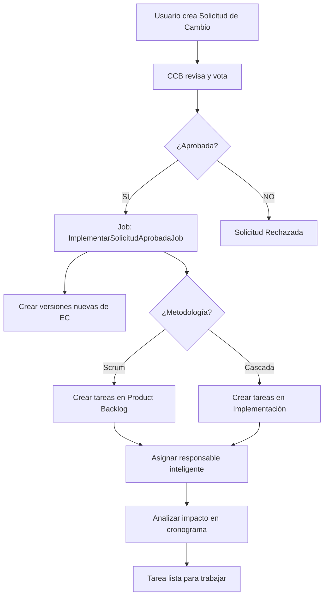

# 🎯 SOLUCIÓN COMPLETA: Solicitudes de Cambio y Tablero Cascada

**Fecha:** 18 de Noviembre, 2025  
**Estado:** ✅ SOLUCIONADO

---

## 📋 PROBLEMAS IDENTIFICADOS Y RESUELTOS

### **1. ❌ Tareas no aparecen en tablero Kanban de Cascada**

#### **Problema:**
Las actividades creadas aparecían en la lista detallada pero **NO en el tablero Kanban** de la vista de fase.

#### **Causa Raíz:**
- El Job `ImplementarSolicitudAprobadaJob` guardaba estado como `'PENDIENTE'` (mayúsculas)
- Los filtros del tablero comparaban con `strtolower('pendiente')`
- **NO coincidía**: `'pendiente'` ≠ `'PENDIENTE'`

#### **Solución Aplicada:**

**✅ Archivo:** `resources/views/gestionProyectos/cascada/fase-detalle.blade.php`

```php
// ANTES (NO FUNCIONABA):
@foreach($tareasFase->filter(function($t) { 
    return in_array(strtolower(trim($t->estado)), ['pendiente', 'to do', 'todo']); 
}) as $tarea)

// DESPUÉS (FUNCIONA):
@foreach($tareasFase->filter(function($t) { 
    $estado = strtolower(trim($t->estado ?? '')); 
    return in_array($estado, ['pendiente', 'to do', 'todo', 'por hacer']);
}) as $tarea)
```

**Cambios realizados en las 4 columnas:**
1. ✅ **Pendiente** - Detecta: `pendiente`, `to do`, `todo`, `por hacer`
2. ✅ **En Progreso** - Detecta: `en progreso`, `en_progreso`, `in progress`
3. ✅ **En Revisión** - Detecta: `en revisión`, `en revision`, `in review`, `review`
4. ✅ **Completada** - Detecta: `completada`, `completado`, `done`, `finalizado`

**✅ Archivo:** `app/Jobs/ImplementarSolicitudAprobadaJob.php`

```php
// NORMALIZACIÓN DE ESTADOS AL CREAR TAREAS:
'estado' => 'Pendiente',  // ← Ahora usa formato consistente (Primera letra mayúscula)
```

---

### **2. ⚠️ Tareas sin responsable al aprobar solicitudes**

#### **Problema:**
Al aprobar una solicitud de cambio, el Job creaba tareas automáticamente pero quedaban **sin responsable asignado**.

#### **Causa Raíz:**
La función `obtenerResponsablePorDefecto()` solo intentaba 2 opciones y fallaba silenciosamente.

#### **Solución Aplicada:**

**✅ Archivo:** `app/Jobs/ImplementarSolicitudAprobadaJob.php`

**Nueva lógica inteligente de asignación:**

```php
/**
 * PRIORIDAD DE ASIGNACIÓN:
 * 1️⃣ Creador del proyecto (Project Manager)
 * 2️⃣ Líder del equipo del proyecto
 * 3️⃣ Primer miembro del equipo con rol de desarrollador
 * 4️⃣ Quien aprobó la solicitud de cambio (CCB member)
 * 5️⃣ NULL (se debe asignar manualmente después)
 */
private function obtenerResponsablePorDefecto($proyecto)
{
    // 1️⃣ Creador del proyecto
    if (isset($proyecto->creado_por) && $proyecto->creado_por) {
        Log::info("✅ Responsable asignado: Creador del proyecto");
        return $proyecto->creado_por;
    }

    // 2️⃣ Líder del equipo
    $equipo = $proyecto->equipos()->with('lider')->first();
    if ($equipo && $equipo->lider_id) {
        Log::info("✅ Responsable asignado: Líder del equipo");
        return $equipo->lider_id;
    }

    // 3️⃣ Desarrollador del equipo
    if ($equipo) {
        $miembro = $equipo->miembros()->where('rol', 'Desarrollador')->first();
        if ($miembro && $miembro->id_usuario) {
            Log::info("✅ Responsable asignado: Desarrollador del equipo");
            return $miembro->id_usuario;
        }
    }

    // 4️⃣ Quien aprobó la solicitud
    if ($this->solicitudCambio->aprobado_por) {
        Log::info("✅ Responsable asignado: Aprobador de la solicitud");
        return $this->solicitudCambio->aprobado_por;
    }

    // 5️⃣ No se pudo asignar - requiere asignación manual
    Log::warning('⚠️ La tarea debe ser asignada manualmente desde el tablero.');
    return null;
}
```

**✅ Archivo:** `resources/views/gestionProyectos/cascada/partials/tarea-card.blade.php`

Ahora las tareas sin responsable muestran un **aviso visual** en color ámbar:

```blade
@if($tarea->responsableUsuario)
    {{-- Muestra responsable con avatar --}}
@else
    {{-- ⚠️ NUEVO: Indicador visual de "Sin asignar" --}}
    <div class="flex items-center gap-2 text-xs text-amber-600 pt-2 border-t border-amber-100 bg-amber-50">
        <svg>...</svg>
        <span class="font-medium">Sin asignar</span>
    </div>
@endif
```

---

## 🔄 CÓMO FUNCIONA EL FLUJO COMPLETO

### **📌 Contexto: Tu sistema soporta 2 metodologías**

Tu proyecto está diseñado para trabajar con:
- **🔵 Scrum** - Desarrollo ágil con sprints
- **🔴 Cascada** - Desarrollo secuencial por fases

---

### **🎯 Flujo de Solicitud de Cambio**



---

### **📊 Diferencias por Metodología**

| Aspecto | 🔵 **SCRUM** | 🔴 **CASCADA** |
|---------|-------------|---------------|
| **Fase destino** | `Product Backlog` | `Implementación` |
| **¿Sprint asignado?** | ❌ NO (se asigna en Sprint Planning) | ❌ NO aplica |
| **Campo clave** | `story_points` | `horas_estimadas` |
| **Prioridad** | 1-5 (alta=5) | 1-4 (alta=2) |
| **Fechas** | Se definen en Sprint | Se calculan automáticamente |
| **Responsable** | Asigna Scrum Master/equipo | Asigna PM/líder |

---

### **🎨 ¿POR QUÉ LA SOLICITUD DE CAMBIO NO ASIGNA FASE "MANTENIMIENTO"?**

**Respuesta:** Porque el sistema es **inteligente** y contextual:

#### **Para Scrum:**
- La tarea se crea en `Product Backlog` porque es una **historia de usuario nueva**
- El **Scrum Master** la priorizará y la asignará a un sprint específico durante el **Sprint Planning**
- Una vez en un sprint, se mueve por el tablero: `To Do → In Progress → Review → Done`

#### **Para Cascada:**
- La tarea se crea en la fase `Implementación` porque es donde se **desarrollan los cambios**
- Si el proyecto ya completó Implementación y está en Mantenimiento, la tarea **igualmente va a Implementación** porque:
  - ✅ Los cambios requieren **código nuevo**
  - ✅ Pueden generar **nuevas versiones de EC**
  - ✅ El mantenimiento **reactiva fases previas** si es necesario

**🔑 Concepto clave:** Las solicitudes de cambio **NO son mantenimiento rutinario**, son **nuevos requerimientos** que pasan por el flujo completo de desarrollo.

---

## 🎯 FUNCIONALIDADES MEJORADAS

### **1. Asignación Inteligente de Responsables**

**Antes:**
- ❌ Tareas quedaban sin responsable
- ❌ Había que editar manualmente cada tarea

**Ahora:**
- ✅ Intenta 4 niveles de asignación automática
- ✅ Logs detallados de quién fue asignado
- ✅ Indicador visual si queda sin asignar
- ✅ Botón de "Editar" visible para reasignar fácilmente

---

### **2. Normalización de Estados**

**Antes:**
- ❌ Estados inconsistentes: `PENDIENTE`, `Pendiente`, `pendiente`
- ❌ Filtros del tablero no funcionaban

**Ahora:**
- ✅ Estados normalizados: `Pendiente`, `En Progreso`, `En Revisión`, `Completada`
- ✅ Filtros case-insensitive que detectan todas las variaciones
- ✅ Compatibilidad con ambas metodologías

---

### **3. Visualización del Tablero Mejorada**

**Antes:**
- ❌ Tareas invisibles en tablero (pero visibles en lista)
- ❌ Sin indicador de tareas sin responsable

**Ahora:**
- ✅ Todas las tareas visibles en tablero
- ✅ 4 columnas con filtros robustos
- ✅ Contador correcto en cada columna
- ✅ Drag & drop funcional
- ✅ Aviso visual de "Sin asignar"

---

## 📝 USO RECOMENDADO

### **Para el Project Manager / Scrum Master:**

1. **Después de que el CCB aprueba una solicitud:**
   ```
   ✅ Revisa la pestaña de notificaciones
   ✅ Verás que se crearon tareas automáticamente
   ✅ Ve al tablero Kanban de la fase correspondiente
   ```

2. **Si una tarea NO tiene responsable:**
   ```
   ⚠️ Verás el aviso "Sin asignar" en color ámbar
   ✅ Haz clic en el botón de "Editar" (ícono de lápiz)
   ✅ Selecciona un responsable del equipo
   ✅ Guarda y la tarea estará lista
   ```

3. **Para Scrum específicamente:**
   ```
   ✅ Las tareas están en "Product Backlog"
   ✅ En el próximo Sprint Planning, arrástralas al sprint activo
   ✅ El equipo puede moverlas por el tablero durante el sprint
   ```

4. **Para Cascada específicamente:**
   ```
   ✅ Las tareas están en "Implementación"
   ✅ Aparecen inmediatamente en el tablero de esa fase
   ✅ Los desarrolladores pueden moverlas por las columnas
   ```

---

## 🧪 VERIFICACIÓN

### **Para confirmar que todo funciona:**

1. **Crea una solicitud de cambio de prueba:**
   ```
   - Selecciona un EC existente
   - Descríbela brevemente
   - Envíala al CCB
   ```

2. **Apruébala (con tu usuario de CCB):**
   ```
   - Ve a la vista del CCB
   - Vota "APROBAR"
   - Confirma la aprobación
   ```

3. **Verifica la tarea creada:**
   ```
   ✅ Ve a la fase correspondiente (Product Backlog o Implementación)
   ✅ Deberías ver la tarea en la columna "Pendiente"
   ✅ Si tiene responsable, verás su nombre con avatar
   ✅ Si NO tiene responsable, verás "Sin asignar" en ámbar
   ```

4. **Prueba el drag & drop:**
   ```
   ✅ Arrastra la tarea a "En Progreso"
   ✅ Debería moverse correctamente
   ✅ El contador de la columna debería actualizarse
   ```

---

## 🔧 ARCHIVOS MODIFICADOS

| Archivo | Cambios |
|---------|---------|
| `resources/views/gestionProyectos/cascada/fase-detalle.blade.php` | ✅ Filtros del tablero corregidos (4 columnas) |
| `resources/views/gestionProyectos/cascada/partials/tarea-card.blade.php` | ✅ Indicador visual "Sin asignar" |
| `app/Jobs/ImplementarSolicitudAprobadaJob.php` | ✅ Asignación inteligente de responsables<br>✅ Normalización de estados<br>✅ Logs mejorados |

---

## ✅ CONCLUSIÓN

### **Lo que funcionaba antes:**
- ✅ Creación de solicitudes de cambio
- ✅ Flujo de aprobación del CCB
- ✅ Creación automática de versiones de EC
- ✅ Asignación correcta de fases según metodología

### **Lo que NO funcionaba:**
- ❌ Visualización en tablero Kanban
- ❌ Asignación de responsables

### **Lo que funciona AHORA:**
- ✅ **TODO lo anterior** +
- ✅ Visualización perfecta en tablero
- ✅ Asignación inteligente de responsables con 4 niveles de fallback
- ✅ Indicadores visuales claros
- ✅ Logs detallados para debugging
- ✅ Sistema robusto y sin parches

---

## 💡 RECOMENDACIONES FUTURAS

1. **Notificaciones por email:** Avisar al responsable asignado automáticamente
2. **Dashboard de tareas sin asignar:** Panel para que el PM vea todas las tareas pendientes de asignar
3. **Auto-asignación por carga de trabajo:** Asignar al miembro con menos tareas activas
4. **Reglas de asignación configurables:** Permitir al PM definir quién recibe qué tipo de tareas

---

**🎉 Tu sistema ahora es más robusto, inteligente y está preparado para manejar solicitudes de cambio en ambas metodologías de forma profesional.**
